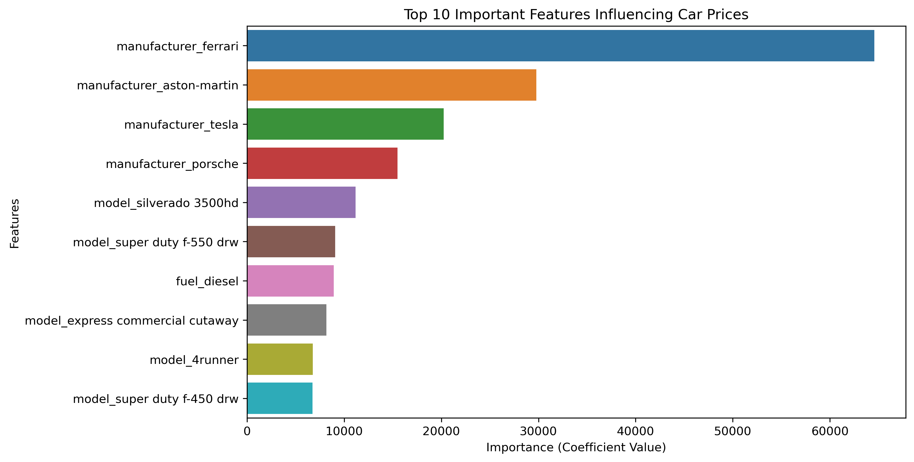

# used-car-dataset-exploration

We were able to generate a pricing approach based on the data provided.
Although it isn't highly precise, it can help create estimated prices to within roughly +/- $10K.

As may not be too surprising, when looking at the most influencial factors we see things like luxury brands, and atypical vehicles.

With continued additions to this dataset, it's accuracy can be expected to improve over time.